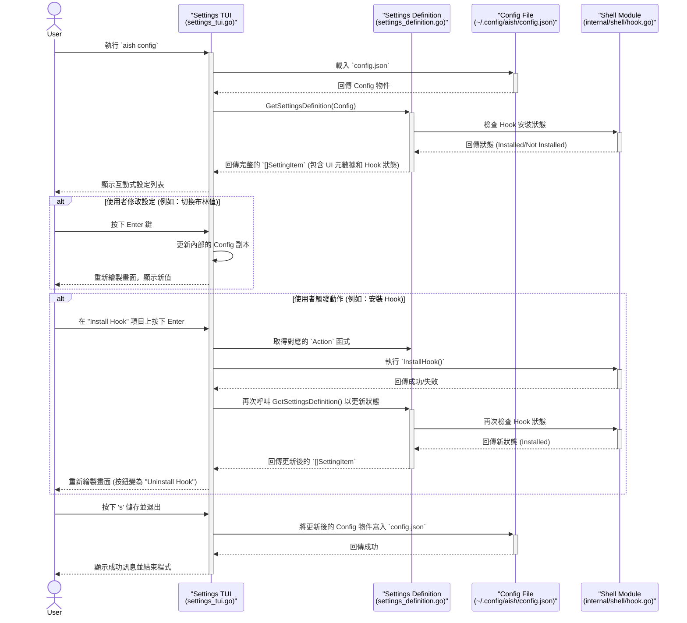

# AISH TUI 設定架構圖

### 圖解說明

1.  **啟動與載入**：使用者執行 `aish config`。TUI 啟動後，首先從磁碟載入 `config.json`。
2.  **動態定義**：TUI 接著呼叫 `GetSettingsDefinition`。此函式會先向 `Shell Module` 查詢 `Hook` 的安裝狀態，然後結合 `Config` 物件和 `Hook` 狀態，動態生成一份包含所有 UI 元數據的設定列表 (`[]SettingItem`)。
3.  **渲染**：TUI 根據這份定義列表，渲染出使用者看到的互動介面。
4.  **互動：修改值**：當使用者修改一個普通的設定（如開關），TUI 只會更新其內部的 `Config` 副本，並立即重繪螢幕以反映變更。這個過程不涉及讀寫檔案或呼叫外部模組。
5.  **互動：執行動作**：當使用者觸發一個動作（如安裝 `Hook`），TUI 會執行 `SettingItem` 中定義的 `Action` 函式，直接呼叫 `Shell Module`。動作完成後，TUI 會**重新**執行第 2 步（動態定義），以獲取最新的狀態（例如 `Hook` 已安裝），並刷新整個介面。
6.  **儲存**：當使用者選擇儲存時，TUI 會將其內部持有的、已更新的 `Config` 副本一次性寫入 `config.json`。

這種設計將「狀態查詢」和「動作執行」與 UI 渲染清晰地分開，並透過元數據定義進行解耦，實現了高度的靈活性和可擴展性。