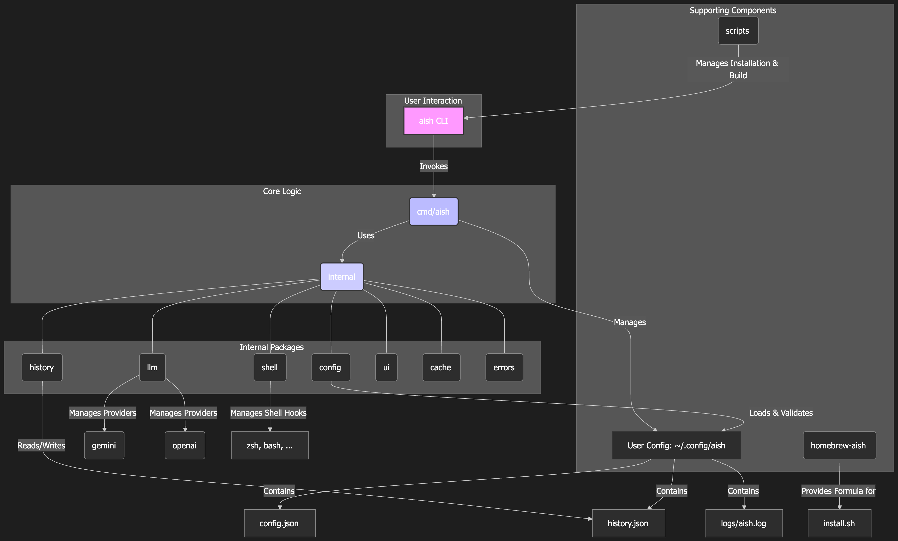

# AISH - AI Shell

**[English](#english) | [繁體中文](./README_zh.md) | [简体中文](./README_zh_cn.md) | [日本語](./README_ja.md)**

A powerful command-line tool that integrates with Google Gemini AI to provide intelligent terminal assistance. AISH automatically captures command errors, analyzes them with AI, and offers smart suggestions and corrections.

> Latest stable release: **v0.0.1**


## Core Features

-   **🤖 Intelligent Error Analysis**: Automatically captures command execution errors, provides AI-driven error classification and analysis, and offers intelligent correction suggestions with explanations.
-   **🔧 Multi-LLM Provider Support**: Supports various LLM providers, including OpenAI (GPT series), Google Gemini (Official API), and Gemini CLI (Cloud Code private API).
-   **📝 Natural Language Command Generation**: Generates shell commands from natural language prompts in English, Chinese, and Japanese. It also provides basic command suggestions in offline mode.
-   **📊 History Tracking and Replay**: Saves error analysis history, allows re-analysis of past errors, and includes a feature to clear the history.
-   **🎯 Smart Shell Hook**: Automatically integrates with your shell (bash/zsh) to capture command outputs and errors in real-time, providing seamless AI assistance without manual intervention.

## System Architecture

The following diagram illustrates how AISH integrates with your shell environment and LLM providers to provide intelligent command assistance:



### Architecture Overview

AISH consists of several key components working together:

- **🔗 Shell Hook**: Automatically captures command execution and errors from your terminal
- **🧠 Error Classifier**: Intelligently categorizes different types of command failures
- **🤖 LLM Providers**: Multiple AI providers (OpenAI, Gemini, Gemini CLI) for intelligent analysis
- **📚 History Manager**: Persistent storage for command history and analysis results
- **⚙️ Configuration System**: Manages user preferences and provider settings
- **🛡️ Security Layer**: Automatically redacts sensitive information before AI analysis

## Installation

There are three ways to install AISH: using Homebrew (easiest), using the installation script, or building from the source manually.

### 1. Using Homebrew (Easiest)

If you're on macOS or Linux with Homebrew installed:

```bash
brew tap TonnyWong1052/aish
brew install aish
```

After installation, run `aish init` to set up the shell hook and configure your LLM provider.

### 2. Using the Installation Script (Recommended)

The script will build the binary, install it into `~/bin`, and provide instructions for adding it to your `PATH`.

```bash
# Clone the repository
git clone https://github.com/TonnyWong1052/aish.git
cd aish

# Run the installation script
./scripts/install.sh

# To automatically run initialization (install hook + config) after installation
./scripts/install.sh --with-init
```

After installation, restart your terminal or source your shell configuration file (e.g., `source ~/.zshrc`). Then, run `aish init` to set up the shell hook and configure your LLM provider.

## 🎯 Shell Hook - The Magic Behind AISH

The **Shell Hook** is the core component that makes AISH truly intelligent and seamless. It automatically integrates with your shell environment to provide real-time AI assistance without any manual intervention.

### What the Hook Does

The Shell Hook automatically:

- **🔍 Captures Command Output**: Monitors both stdout and stderr from every command you run
- **🚨 Detects Errors**: Intelligently identifies when commands fail (non-zero exit codes)
- **🛡️ Filters Noise**: Skips user-initiated interruptions (Ctrl+C, Ctrl+\) and AISH's own commands
- **🔒 Sanitizes Sensitive Data**: Automatically redacts API keys, tokens, passwords, and other sensitive information before sending to AI
- **⚡ Triggers AI Analysis**: Automatically calls AISH when errors are detected, providing instant feedback

### How It Works

1. **Pre-command Capture**: Before each command runs, the hook captures the command and prepares output redirection
2. **Output Monitoring**: During command execution, all output (stdout/stderr) is captured to temporary files
3. **Post-command Analysis**: After command completion, the hook checks the exit code and triggers AI analysis if needed
4. **Smart Filtering**: Only meaningful errors are sent for analysis, avoiding spam from intentional interruptions

### Supported Shells

- **🐚 Bash**: Uses `trap DEBUG` and `PROMPT_COMMAND` for command interception
- **🐚 Zsh**: Uses `preexec` and `precmd` hooks for seamless integration
- **🪟 PowerShell**: Uses profile modification for Windows environments

### Security Features

- **🔐 Automatic Redaction**: Sensitive parameters like `--api-key`, `--token`, `--password` are automatically masked
- **🛡️ Environment Variable Protection**: Variables containing `SECRET`, `TOKEN`, `PASSWORD`, `API_KEY` are redacted
- **🚫 Self-Protection**: Prevents infinite loops by ignoring AISH's own commands
- **📁 Secure Storage**: All temporary files are stored in `~/.config/aish/` with proper permissions

### Avoiding Interactive Command Conflicts

Some interactive CLI tools depend on direct TTY streams and may misbehave when their output is mirrored through the hook's `tee` process. AISH skips the `claude` CLI by default, and you can add your own patterns through the `AISH_SKIP_COMMAND_PATTERNS` environment variable (whitespace-separated globs):

```bash
export AISH_SKIP_COMMAND_PATTERNS="claude gh* fzf"
```

Both the first token and the full command line are matched against each pattern, so `gh auth login` can be skipped with either `gh` or `gh auth*`. Reload your shell configuration after changing the variable.

#### Skip All User-Installed Commands

If you prefer to capture only "system" commands and skip everything installed by Homebrew/npm/pipx/etc., turn on:

```bash
export AISH_SKIP_ALL_USER_COMMANDS=1
# Optional: customize what counts as a system directory (colon-separated)
export AISH_SYSTEM_DIR_WHITELIST="/bin:/usr/bin:/sbin:/usr/sbin:/usr/libexec:/System/Library:/lib:/usr/lib"
```

When enabled, AISH resolves the command path and skips capture if it is NOT under any of the whitelisted system directories. This means paths like `/opt/homebrew/bin`, `/usr/local/bin`, `~/.bun/bin`, `~/.local/bin`, `~/go/bin`, etc. will be treated as user-installed and skipped.

For a one-off bypass without changing your environment:

```bash
AISH_CAPTURE_OFF=1 <your-command>
```

### Hook Installation

The hook is automatically installed when you run `aish init`. It modifies your shell configuration files:

- **Bash**: Adds to `~/.bashrc` or `~/.bash_profile`
- **Zsh**: Adds to `~/.zshrc`
- **PowerShell**: Adds to your PowerShell profile

### 🏷️ Error Classification System

The Hook includes an intelligent error classification system that categorizes different types of command failures for more targeted AI analysis:

#### **CommandNotFound** 🔍
- **Trigger**: `command not found` errors
- **Examples**: 
  ```bash
  $ unknowncmd
  bash: unknowncmd: command not found
  ```
- **AI Response**: Suggests similar commands, installation instructions, or typo corrections

#### **FileNotFoundOrDirectory** 📁
- **Trigger**: `No such file or directory` errors
- **Examples**:
  ```bash
  $ cat /nonexistent/file
  cat: /nonexistent/file: No such file or directory
  ```
- **AI Response**: Suggests correct file paths, directory listings, or file creation

#### **PermissionDenied** 🔒
- **Trigger**: `Permission denied` errors
- **Examples**:
  ```bash
  $ cat /root/secret
  cat: /root/secret: Permission denied
  ```
- **AI Response**: Suggests permission fixes, sudo usage, or alternative approaches

#### **CannotExecute** ⚠️
- **Trigger**: `cannot execute binary file` errors
- **Examples**:
  ```bash
  $ ./script
  bash: ./script: cannot execute binary file
  ```
- **AI Response**: Suggests making files executable, checking file types, or interpreter issues

#### **InvalidArgumentOrOption** ❌
- **Trigger**: `invalid argument` or `invalid option` errors
- **Examples**:
  ```bash
  $ ls -Z
  ls: invalid option -- 'Z'
  ```
- **AI Response**: Suggests correct command syntax, available options, or usage examples

#### **ResourceExists** 📄
- **Trigger**: `File exists` errors
- **Examples**:
  ```bash
  $ mkdir /tmp/test
  mkdir: /tmp/test: File exists
  ```
- **AI Response**: Suggests overwrite options, different names, or removal strategies

#### **NotADirectory** 📂
- **Trigger**: `is not a directory` errors
- **Examples**:
  ```bash
  $ cd /etc/passwd
  cd: /etc/passwd: is not a directory
  ```
- **AI Response**: Suggests correct directory paths or file vs directory operations

#### **TerminatedBySignal** ⏹️
- **Trigger**: Exit codes > 128 (signal termination)
- **Examples**:
  ```bash
  $ long-running-command
  ^C  # Ctrl+C interruption (exit code 130)
  ```
- **AI Response**: Explains signal termination, suggests resuming or alternative approaches

#### **GenericError** 🔧
- **Trigger**: All other error types
- **Examples**: Custom application errors, network issues, etc.
- **AI Response**: General troubleshooting advice and context-specific solutions

### 🎯 Classification Benefits

- **🎯 Targeted Responses**: Each error type receives specialized AI analysis
- **📚 Learning Context**: AI understands the specific nature of each failure
- **⚡ Faster Resolution**: More accurate suggestions based on error category
- **🔄 Consistent Handling**: Standardized approach to common error patterns

## LLM Provider Configuration

AISH supports multiple LLM providers. Here are the recommended configurations:

### 🚀 Gemini CLI (Recommended)
For the best experience, we recommend using **Gemini CLI** as it provides:
- **Free access** to Google's Gemini models
- **No API key required** (uses your Google account authentication)
- **Higher rate limits** compared to official API
- **Better integration** with Google's ecosystem

To set up Gemini CLI:
```bash
# Install Gemini CLI (if not already installed)
# Follow instructions at: https://github.com/google/generative-ai-cli

# Configure AISH to use Gemini CLI
aish init
# Select "gemini-cli" when prompted for LLM provider
```

### 🔑 Alternative: Official Gemini API
If you prefer the official API:
```bash
# Get your API key from: https://aistudio.google.com/app/apikey
aish init
# Select "gemini" when prompted for LLM provider
# Enter your API key when prompted
```

### 🤖 OpenAI GPT (Alternative)
For OpenAI users:
```bash
aish init
# Select "openai" when prompted for LLM provider
# Enter your OpenAI API key when prompted
```

### 3. Manual Installation

If you prefer to build and install manually:

```bash
# 1. Build the application
# The main CLI entry point is in cmd/aish
go build -o aish ./cmd/aish

# 2. Move the binary to a directory in your PATH
# For example, ~/bin
mkdir -p ~/bin
mv aish ~/bin

# 3. Install the shell hook and configure
aish init
```

## See It in Action

Experience the power of AISH with these real-world examples:

### 🚨 Automatic Error Analysis (Powered by Shell Hook)
When you make a mistake, AISH's Shell Hook automatically captures the error and provides intelligent feedback:

```bash
$ ls /nonexistent
ls: cannot access '/nonexistent': No such file or directory

🧠 AISH Analysis:
┌─ Error Explanation ─────────────────────────────────────────┐
│ The 'ls' command failed because the path '/nonexistent'    │
│ does not exist on your filesystem.                         │
└────────────────────────────────────────────────────────────┘

💡 Suggestion: Check if the directory path is correct.
   You can use 'ls /' to see the contents of the root directory.

🔧 Corrected Command:
   ls /

Press [Enter] to run the corrected command, or any other key to dismiss.
```

**What happened behind the scenes:**
1. 🔍 Hook captured the command `ls /nonexistent`
2. 📊 Hook monitored stdout/stderr during execution
3. 🚨 Hook detected non-zero exit code (command failed)
4. 🧠 Hook automatically triggered AISH analysis
5. 💡 AISH provided intelligent error explanation and solution

### 🤖 Natural Language Command Generation
Generate shell commands from plain English:

```bash
tomleung@LeungdeMacBook-Air Powerful-CLI % aish -p "find all .go files in the current directory"
Generating command...                                                           
 SUCCESS  Generating command...                                                 
                           
     Generated Command     
                           
Explanation:
Based on your prompt "find all .go files in the current directory", I'll generate a command to search for Go files in the current directory.

Suggested Command:
find . -name "*.go"

Options:
  [Enter] - Execute the suggested command
  [n/no]  - Reject and exit
  [other] - Provide a new prompt for a different suggestion

Select an option: 
```

```bash
tomleung@LeungdeMacBook-Air Powerful-CLI % aish -p "show me the git status in a nice format"
Generating command...                                                           
 SUCCESS  Generating command...                                                 
                           
     Generated Command     
                           
Explanation:
I'll create a command that shows git status in a more readable format with emojis and clear indicators.

Suggested Command:
git status --porcelain | while read status file; do
  case $status in
    M) echo "📝 Modified: $file" ;;
    A) echo "➕ Added: $file" ;;
    D) echo "🗑️  Deleted: $file" ;;
    ?) echo "❓ Untracked: $file" ;;
  esac
done

Options:
  [Enter] - Execute the suggested command
  [n/no]  - Reject and exit
  [other] - Provide a new prompt for a different suggestion

Select an option: 
```

### 📊 History and Replay
Review and re-analyze past errors captured by the Hook:

```bash
$ aish history
📋 Recent Error Analysis History:
   1. [2 min ago] ls /nonexistent - File not found
   2. [15 min ago] git push origin main - Authentication failed
   3. [1 hour ago] docker run nginx - Port already in use

$ aish history 2
🔄 Re-analyzing error #2...
[Shows detailed analysis of the git push error]
```

### 🔒 Security in Action - Sensitive Data Protection
The Hook automatically protects your sensitive information:

```bash
# Command with sensitive data
$ curl -H "Authorization: Bearer sk-1234567890abcdef" https://api.example.com

# What the Hook captures (sensitive data redacted):
# curl -H "Authorization: Bearer ***REDACTED***" https://api.example.com

# Even environment variables are protected:
$ API_KEY=secret123 npm run deploy
# Hook captures: API_KEY=***REDACTED*** npm run deploy
```

### 🛡️ Smart Filtering Examples
The Hook intelligently filters out noise:

```bash
# ✅ These will trigger AISH analysis:
$ git push origin main
# Error: Authentication failed

$ docker run nginx
# Error: Port 80 already in use

$ npm install
# Error: Package not found

# ❌ These will NOT trigger AISH (intentionally filtered):
$ ^C  # Ctrl+C interruption
$ ^\  # Ctrl+\ termination
$ aish capture  # AISH's own commands
```


## Quick Start

-   **Error Capture (Automatic)**: When a command fails, AISH will automatically analyze the error and provide suggestions.
    ```bash
    # Execute a wrong command
    ls /nonexistent
    # AISH will automatically analyze and provide a fix.
    ```
-   **Natural Language Commands**: Use the `-p` flag to generate commands from natural language.
    ```bash
    aish -p "list all files in the current directory"
    aish -p "find all .go files"
    ```

## Configuration

After installation, you need to configure AISH with your preferred LLM provider:

```bash
# Initialize AISH configuration
aish init
```

This will guide you through:
- Selecting your LLM provider (Gemini CLI, Gemini API, or OpenAI)
- Setting up API keys (if needed)
- Installing the shell hook for automatic error capture

## Usage

### Automatic Error Analysis
Once configured, AISH automatically captures and analyzes command errors:

```bash
# Make a mistake - AISH will automatically help
$ ls /nonexistent
ls: cannot access '/nonexistent': No such file or directory

# AISH automatically provides analysis and suggestions
```

### Manual Command Generation
Generate commands from natural language:

```bash
aish -p "find all .go files in the current directory"
aish -p "show me the git status in a nice format"
```

### View History
Review past error analyses:

```bash
aish history
```

## Contributing

We welcome contributions! Please see our [Contributing Guidelines](CONTRIBUTING.md) for details.

## License

This project is licensed under the MIT License - see the [LICENSE](LICENSE) file for details.
