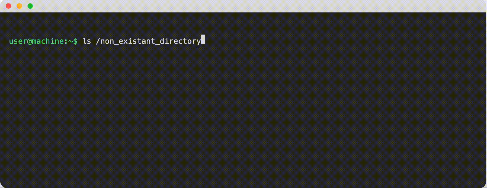
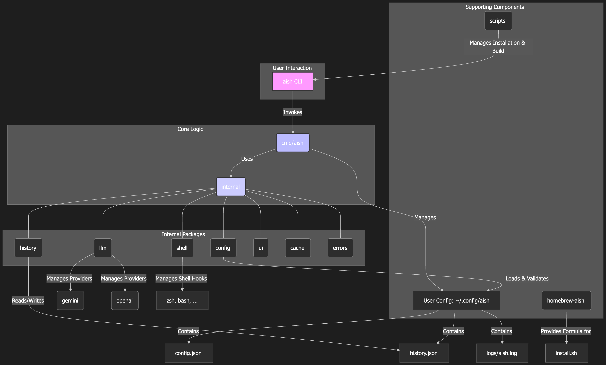

# AISH - AI Shell

**[English](./README.md) | [繁體中文](./README_zh.md) | [简体中文](#简体中文) | [日本語](./README_ja.md)**

一个功能强大的命令行工具，集成 Google Gemini AI，提供智能终端协助。AISH 自动捕获命令错误，通过 AI 分析并提供智能建议和修正。

> 最新稳定版本：**v0.0.1**



## 核心功能与架构

AISH 与您的 shell 环境和 LLM 提供商集成，提供智能命令协助：

### 主要功能

-   **🤖 智能错误分析**：自动捕获命令执行错误、提供 AI 驱动的错误分类与分析，并提供智能修正建议与解释。
-   **🔧 多 LLM 提供商支持**：支持多种 LLM 提供商，包括 OpenAI (GPT 系列)、Google Gemini (官方 API) 以及 Gemini CLI (Cloud Code 私有 API)。
-   **📝 自然语言命令生成**：能从自然语言提示（支持英文、中文、日文）生成 Shell 命令，并在离线模式下提供基础命令建议。
-   **📊 历史追踪与重放**：保存错误分析历史、允许重新分析历史错误，并包含清理历史记录的功能。
-   **🎯 智能 Shell Hook**：自动整合到您的 shell (bash/zsh) 中，实时捕获命令输出和错误，提供无缝的 AI 协助而无需手动干预。

### 系统组件

以下图表展示了 AISH 如何与您的 shell 环境和 LLM 提供商集成，以提供智能命令协助：



### 架构概述

AISH 由多个关键组件协同工作：

- **🔗 Shell Hook**：自动捕获终端中的命令执行和错误
- **🧠 错误分类器**：智能分类不同类型的命令失败
- **🤖 LLM 提供商**：多个 AI 提供商（OpenAI、Gemini、Gemini CLI）进行智能分析
- **📚 历史管理器**：持久化存储命令历史和分析结果
- **⚙️ 配置系统**：管理用户偏好和提供商设置
- **🛡️ 安全层**：在 AI 分析前自动遮蔽敏感信息

## 安装与配置

您可以通过三种方式安装 AISH：使用 Homebrew（最简单）、使用安装脚本或手动从源码构建。

### 1. 使用 Homebrew（最简单）

如果您在 macOS 或已安装 Homebrew 的 Linux 系统上：

```bash
brew tap TonnyWong1052/aish
brew install aish
```

安装完成后，执行 `aish init` 来设定 shell hook 并配置您的 LLM 提供商。

### 2. 使用安装脚本（推荐）

此脚本将会构建执行文件，将其安装到 `~/bin`，并提供将其加入 `PATH` 的指引。

```bash
# 克隆项目
git clone https://github.com/TonnyWong1052/aish.git
cd aish

# 运行安装脚本
./scripts/install.sh

# 如果希望在安装后自动执行初始化（安装 hook + 配置）
./scripts/install.sh --with-init
```

安装完成后，请重启您的终端机，或加载您的 shell 配置文件（例如：`source ~/.zshrc`）。然后，执行 `aish init` 来设定 shell hook 并配置您的 LLM 提供商。

## 🎯 Shell Hook - AISH 背后的魔法

**Shell Hook** 是让 AISH 真正智能和无缝的核心组件。它自动整合到您的 shell 环境中，提供实时 AI 协助而无需任何手动干预。

### Hook 的功能

Shell Hook 自动：

- **🔍 捕获命令输出**：监控您执行的每个命令的 stdout 和 stderr
- **🚨 检测错误**：智能识别命令何时失败（非零退出码）
- **🛡️ 过滤噪音**：跳过用户主动中断（Ctrl+C、Ctrl+\）和 AISH 自身的命令
- **🔒 清理敏感数据**：在发送给 AI 之前自动遮罩 API 密钥、tokens、密码和其他敏感信息
- **⚡ 触发 AI 分析**：检测到错误时自动调用 AISH，提供实时反馈

### 工作原理

1. **命令前捕获**：在每个命令执行前，hook 捕获命令并准备输出重定向
2. **输出监控**：在命令执行期间，所有输出（stdout/stderr）被捕获到临时文件
3. **命令后分析**：命令完成后，hook 检查退出码并在需要时触发 AI 分析
4. **智能过滤**：只有有意义的错误才会发送进行分析，避免来自故意中断的垃圾信息

### 支持的 Shell

- **🐚 Bash**：使用 `trap DEBUG` 和 `PROMPT_COMMAND` 进行命令拦截
- **🐚 Zsh**：使用 `preexec` 和 `precmd` hooks 实现无缝整合
- **🪟 PowerShell**：使用 profile 修改支持 Windows 环境

### 安全功能

- **🔐 自动遮罩**：敏感参数如 `--api-key`、`--token`、`--password` 会自动遮罩
- **🛡️ 环境变量保护**：包含 `SECRET`、`TOKEN`、`PASSWORD`、`API_KEY` 的变量会被遮罩
- **🚫 自我保护**：通过忽略 AISH 自身的命令防止无限循环
- **📁 安全存储**：所有临时文件都存储在 `~/.config/aish/` 中，具有适当的权限

### 避免交互式指令冲突

部分高度交互的 CLI（例如全屏 TUI、需要真实 TTY 的工具）在输出被 hook 以 `tee` 镜像时可能异常。AISH 默认略过 `claude`，你也可以通过以下方式控制略过行为：

- 自定义样式略过（同时匹配第一个 token 与整行命令）：
  ```bash
  export AISH_SKIP_COMMAND_PATTERNS="claude gh* fzf npm run *:watch"
  ```
- 略过所有用户安装指令，只捕捉系统指令（推荐）：
  ```bash
  export AISH_SKIP_ALL_USER_COMMANDS=1
  # 可选：自定义系统白名单目录（以冒号分隔）
  export AISH_SYSTEM_DIR_WHITELIST="/bin:/usr/bin:/sbin:/usr/sbin:/usr/libexec:/System/Library:/lib:/usr/lib"
  ```
  开启后，凡是不在白名单目录下的可执行文件（如 `/opt/homebrew/bin`、`/usr/local/bin`、`~/.bun/bin`、`~/.local/bin`、`~/go/bin` 等）会被视为用户安装并跳过。
- 单次绕过（本次完全不捕捉）：
  ```bash
  AISH_CAPTURE_OFF=1 <your-command>
  ```
- 完全不安装 hook（当前 shell 会话）：
  ```bash
  export AISH_HOOK_DISABLED=1
  ```

执行 `aish hook init` 时也会提供「Skip Rules」交互设置，会把你的偏好写入 `~/.config/aish/env.sh`（POSIX）与 `env.ps1`（PowerShell），hook 启动时自动加载。

### Hook 安装

Hook 在您执行 `aish init` 时自动安装。它会修改您的 shell 配置文件：

- **Bash**：添加到 `~/.bashrc` 或 `~/.bash_profile`
- **Zsh**：添加到 `~/.zshrc`
- **PowerShell**：添加到您的 PowerShell profile

### 🏷️ 错误分类系统

Hook 包含一个智能错误分类系统，将不同类型的命令失败进行分类，以提供更有针对性的 AI 分析：

#### **CommandNotFound** 🔍
- **触发条件**：`command not found` 错误
- **示例**：
  ```bash
  $ unknowncmd
  bash: unknowncmd: command not found
  ```
- **AI 回应**：建议类似命令、安装说明或拼写错误修正

#### **FileNotFoundOrDirectory** 📁
- **触发条件**：`No such file or directory` 错误
- **示例**：
  ```bash
  $ cat /nonexistent/file
  cat: /nonexistent/file: No such file or directory
  ```
- **AI 回应**：建议正确的文件路径、目录列表或文件创建

#### **PermissionDenied** 🔒
- **触发条件**：`Permission denied` 错误
- **示例**：
  ```bash
  $ cat /root/secret
  cat: /root/secret: Permission denied
  ```
- **AI 回应**：建议权限修正、sudo 使用或替代方法

#### **CannotExecute** ⚠️
- **触发条件**：`cannot execute binary file` 错误
- **示例**：
  ```bash
  $ ./script
  bash: ./script: cannot execute binary file
  ```
- **AI 回应**：建议使文件可执行、检查文件类型或解释器问题

#### **InvalidArgumentOrOption** ❌
- **触发条件**：`invalid argument` 或 `invalid option` 错误
- **示例**：
  ```bash
  $ ls -Z
  ls: invalid option -- 'Z'
  ```
- **AI 回应**：建议正确的命令语法、可用选项或使用示例

#### **ResourceExists** 📄
- **触发条件**：`File exists` 错误
- **示例**：
  ```bash
  $ mkdir /tmp/test
  mkdir: /tmp/test: File exists
  ```
- **AI 回应**：建议覆盖选项、不同名称或移除策略

#### **NotADirectory** 📂
- **触发条件**：`is not a directory` 错误
- **示例**：
  ```bash
  $ cd /etc/passwd
  cd: /etc/passwd: is not a directory
  ```
- **AI 回应**：建议正确的目录路径或文件与目录操作

#### **TerminatedBySignal** ⏹️
- **触发条件**：退出码 > 128（信号终止）
- **示例**：
  ```bash
  $ long-running-command
  ^C  # Ctrl+C 中断（退出码 130）
  ```
- **AI 回应**：解释信号终止，建议恢复或替代方法

#### **GenericError** 🔧
- **触发条件**：所有其他错误类型
- **示例**：自定义应用程序错误、网络问题等
- **AI 回应**：一般故障排除建议和上下文特定解决方案

### 🎯 分类优势

- **🎯 针对性回应**：每种错误类型都会收到专门的 AI 分析
- **📚 学习上下文**：AI 理解每种失败的具体性质
- **⚡ 更快解决**：基于错误类别的更准确建议
- **🔄 一致处理**：对常见错误模式的标准化方法

## LLM 提供商配置

AISH 支持多种 LLM 提供商。以下是推荐的配置：

### 🚀 Gemini CLI（推荐）
为了获得最佳体验，我们推荐使用 **Gemini CLI**，因为它提供：
- **免费访问** Google 的 Gemini 模型
- **无需 API 密钥**（使用您的 Google 账户认证）
- **更高的速率限制**，相比官方 API
- **更好的整合** 与 Google 生态系统

设置 Gemini CLI：
```bash
# 安装 Gemini CLI（如果尚未安装）
# 请参考：https://github.com/google/generative-ai-cli

# 配置 AISH 使用 Gemini CLI
aish init
# 当提示选择 LLM 提供商时，选择 "gemini-cli"
```

### 🔑 替代方案：官方 Gemini API
如果您偏好官方 API：
```bash
# 从以下网址获取您的 API 密钥：https://aistudio.google.com/app/apikey
aish init
# 当提示选择 LLM 提供商时，选择 "gemini"
# 当提示时输入您的 API 密钥
```

### 🤖 OpenAI GPT（替代方案）
对于 OpenAI 用户：
```bash
aish init
# 当提示选择 LLM 提供商时，选择 "openai"
# 当提示时输入您的 OpenAI API 密钥
```

### 3. 手动安装

如果您偏好手动构建与安装：

```bash
# 1. 构建应用程序
# CLI 主要入口点位于 cmd/aish
go build -o aish ./cmd/aish

# 2. 将执行文件移动到您 PATH 中的目录
# 例如 ~/bin
mkdir -p ~/bin
mv aish ~/bin

# 3. 安装 shell hook 并进行配置
aish init
```

## 实际演示

体验 AISH 的强大功能，看看这些真实使用场景：

### 🚨 自动错误分析
当您犯错时，AISH 立即提供智能反馈：

```bash
$ ls /nonexistent
ls: cannot access '/nonexistent': No such file or directory

🧠 AISH 分析：
┌─ 错误解释 ─────────────────────────────────────────┐
│ 'ls' 命令失败是因为路径 '/nonexistent' 在您的    │
│ 文件系统中不存在。                                │
└────────────────────────────────────────────────────┘

💡 建议：检查目录路径是否正确。
   您可以使用 'ls /' 来查看根目录的内容。

🔧 修正后的命令：
   ls /

按 [Enter] 执行修正后的命令，或按其他键取消。
```

### 🤖 自然语言命令生成
从普通英文生成 shell 命令：

```bash
tomleung@LeungdeMacBook-Air Powerful-CLI % aish -p "find all .go files in the current directory"
Generating command...                                                           
 SUCCESS  Generating command...                                                 
                           
     Generated Command     
                           
Explanation:
基于您的提示 "find all .go files in the current directory"，我将生成一个命令来搜索当前目录中的 Go 文件。

Suggested Command:
find . -name "*.go"

Options:
  [Enter] - 执行建议的命令
  [n/no]  - 拒绝并退出
  [other] - 提供新的提示以获得不同的建议

Select an option: 
```

```bash
tomleung@LeungdeMacBook-Air Powerful-CLI % aish -p "show me the git status in a nice format"
Generating command...                                                           
 SUCCESS  Generating command...                                                 
                           
     Generated Command     
                           
Explanation:
我将创建一个命令，以更易读的格式显示 git 状态，包含表情符号和清晰的指示器。

Suggested Command:
git status --porcelain | while read status file; do
  case $status in
    M) echo "📝 已修改: $file" ;;
    A) echo "➕ 已添加: $file" ;;
    D) echo "🗑️  已删除: $file" ;;
    ?) echo "❓ 未跟踪: $file" ;;
  esac
done

Options:
  [Enter] - 执行建议的命令
  [n/no]  - 拒绝并退出
  [other] - 提供新的提示以获得不同的建议

Select an option: 
```

### 📊 历史记录与重放
查看和重新分析过去的错误：

```bash
$ aish history
📋 最近的错误分析历史：
   1. [2 分钟前] ls /nonexistent - 文件不存在
   2. [15 分钟前] git push origin main - 认证失败
   3. [1 小时前] docker run nginx - 端口已被使用

$ aish history 2
🔄 重新分析错误 #2...
[显示 git push 错误的详细分析]
```

### 🔒 安全功能演示 - 敏感数据保护
Hook 自动保护您的敏感信息：

```bash
# 包含敏感数据的命令
$ curl -H "Authorization: Bearer sk-1234567890abcdef" https://api.example.com

# Hook 捕获的内容（敏感数据已遮蔽）：
# curl -H "Authorization: Bearer ***REDACTED***" https://api.example.com

# 甚至环境变量也会被保护：
$ API_KEY=secret123 npm run deploy
# Hook 捕获：API_KEY=***REDACTED*** npm run deploy
```

### 🛡️ 智能过滤示例
Hook 智能过滤噪音：

```bash
# ✅ 这些会触发 AISH 分析：
$ git push origin main
# 错误：认证失败

$ docker run nginx
# 错误：端口 80 已被使用

$ npm install
# 错误：找不到包

# ❌ 这些不会触发 AISH（故意过滤）：
$ ^C  # Ctrl+C 中断
$ ^\  # Ctrl+\ 终止
$ aish capture  # AISH 自己的命令
```

## 快速开始

-   **错误捕获（自动触发）**：当命令执行失败时，AISH 会自动分析错误并提供建议。
    ```bash
    # 执行一个错误的命令
    ls /nonexistent
    # AISH 将自动分析并提供修正建议。
    ```
-   **自然语言命令**：使用 `-p` 参数从自然语言生成命令。
    ```bash
    aish -p "列出当前目录中的所有文件"
    aish -p "查找所有 .go 文件"
    ```

## 配置

安装完成后，您需要配置 AISH 选择您偏好的 LLM 提供商：

```bash
# 初始化 AISH 配置
aish init
```

这将引导您完成：
- 选择您的 LLM 提供商（Gemini CLI、Gemini API 或 OpenAI）
- 设置 API 密钥（如需要）
- 安装 shell hook 以自动捕获错误

## 使用

### 自动错误分析
配置完成后，AISH 会自动捕获和分析命令错误：

```bash
# 犯个错误 - AISH 会自动帮助
$ ls /nonexistent
ls: cannot access '/nonexistent': No such file or directory

# AISH 自动提供分析和建议
```

### 手动命令生成
从自然语言生成命令：

```bash
aish -p "查找当前目录中的所有 .go 文件"
aish -p "以美观格式显示 git 状态"
```

### 查看历史
查看过去的错误分析：

```bash
aish history
```

## 贡献

我们欢迎贡献！详情请参阅我们的[贡献指南](CONTRIBUTING.md)。

## 授权

本项目采用 MIT 授权条款 - 详情请参阅 [LICENSE](LICENSE) 文件。
