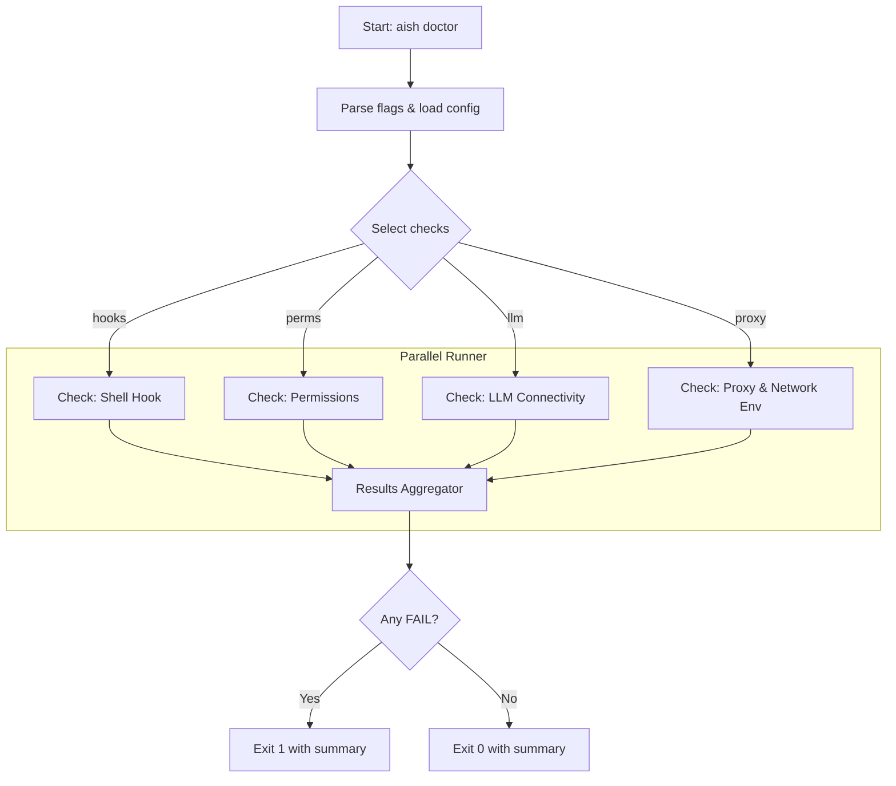
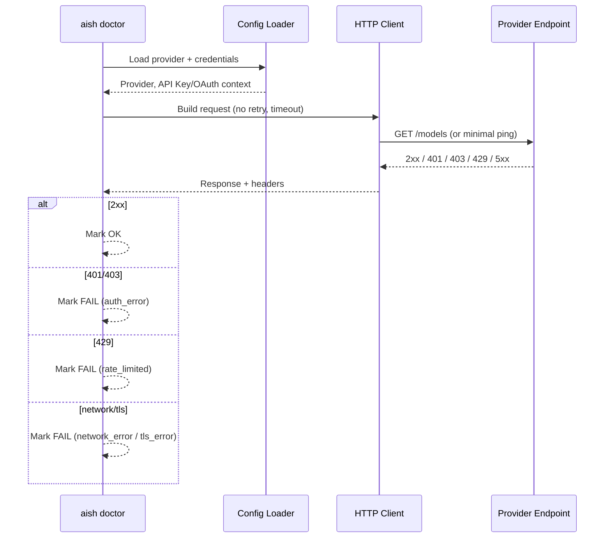
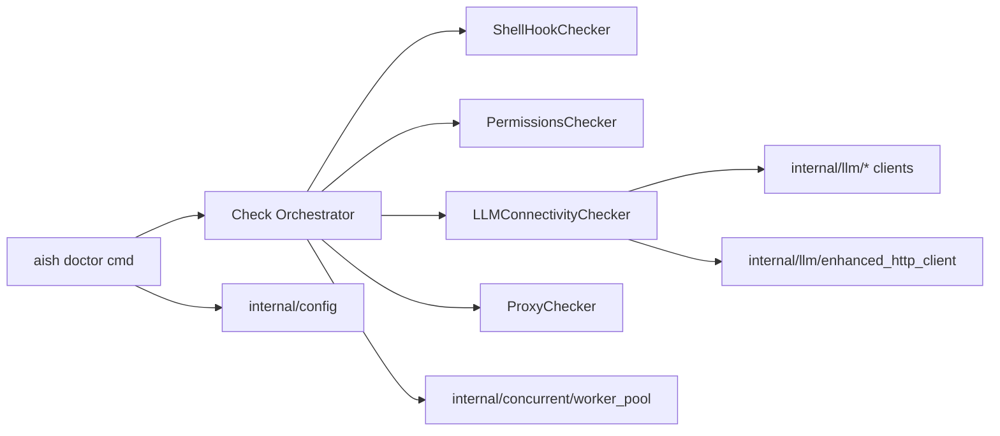

# `aish doctor` Command Architecture

## 1. Overall Goal

Create a subcommand `aish doctor` to automatically diagnose common issues in the `aish` setup. This command will provide a series of checks, offering clear success/failure status and repair suggestions for each.

---

## Deep Design Review

This section expands the initial design with detailed checks, CLI contract, data model, concurrency strategy, provider-specific probes, error taxonomy, diagrams, and test strategy.

### 0) Scope, Guarantees, Non-Goals
- Guarantees:
  - Deterministic, idempotent checks with clear OK/WARN/FAIL status.
  - No writes unless `--fix` is explicitly provided.
  - No sensitive data printed (mask API keys; redact tokens).
- Non-goals:
  - Changing global user environment automatically (unless `--fix`).
  - Long-running network diagnostics; keep under `--timeout`.
- Performance: All checks complete under default timeout (e.g., 5s–10s), parallelized where safe.

### 1) CLI Spec
- Command: `aish doctor`
- Flags:
  - `--all` (default): run all checks.
  - `--hooks`: run hook installation checks only.
  - `--perms`: run permissions checks only.
  - `--llm`: run LLM connectivity checks only.
  - `--proxy`: run proxy and network env checks only.
  - `--provider=<auto|openai|gemini|anthropic|ollama>`: narrow LLM check; default `auto` from config.
  - `--timeout=5s`: per-network-check timeout (context deadline).
  - `--json`: machine-readable output (single JSON object).
  - `--verbose`: include details, HTTP status, headers (safe subset).
  - `--fix`: guided remediation for safe operations (e.g., install shell hook).
  - `--no-parallel`: force sequential execution for debugging.
- Exit codes:
  - `0`: no FAIL; OK or WARN only.
  - `1`: at least one FAIL.

### 2) Check Matrix and Implementation Notes

1) Shell Hook Installation (POSIX + PowerShell)
- Purpose: Ensure `aish` CLI hooks are active in shell sessions.
- Sources:
  - internal/shell/assets/hook.sh, hook.ps1
  - internal/shell/hook.go (expected install flow; `aish init`)
- Strategy:
  - Detect shell via `SHELL` (POSIX) or `ComSpec`/PowerShell profile (Windows).
  - Inspect profile files:
    - bash: `~/.bashrc`, `~/.bash_profile`
    - zsh: `~/.zshrc`
    - fish: `~/.config/fish/config.fish`
    - PowerShell: `$PROFILE` (e.g., `Documents/PowerShell/Microsoft.PowerShell_profile.ps1`)
  - Heuristics:
    - Look for `aish` hook signature lines (e.g., `source .../hook.sh`, `. .../hook.ps1`).
    - Verify hook asset exists on disk.
  - Output:
    - OK if signature found and asset readable.
    - FAIL if missing.
    - Suggestion: run `aish init` or `aish init --shell <name>`; with `--fix`, attempt install.
  - Cross-OS:
    - Windows: no UNIX perms; just existence + readable check.
    - POSIX: ensure `hook.sh` is readable; executable not strictly required for `source`.

2) Permissions and Paths
- Purpose: Ensure config/history/log paths exist with R/W as needed.
- Sources:
  - internal/config/constants.go, config.go
  - internal/history/*
  - logs directory if present
- Strategy:
  - Resolve config dir via XDG (`~/.config/aish` on Linux), `~/Library/Application Support/aish` (macOS), `%APPDATA%\aish` (Windows).
  - Files/dirs to probe (best-effort, do not fail if missing unless required by runtime):
    - `config.json` or equivalent persisted config: readable.
    - `history/` (or file): read/write (attempt create temp file in target dir to validate write).
    - `logs/`: writable if logging enabled (check via config or presence).
  - Output:
    - OK on accessible.
    - FAIL if cannot read/write as required.
    - Suggestion: show `chmod/chown` guidance (POSIX), path validation on Windows.

3) LLM Connectivity (Provider-Aware)
- Purpose: Validate active provider configuration and network/access health.
- Sources:
  - internal/config/config.go (selected provider; keys)
  - internal/llm/* clients and http client wrappers
  - internal/errors/* (retry, circuit breaking)
- Strategy:
  - Resolve provider:
    - If `--provider` set, use it; else load from config.
    - Confirm API key present (if required) via config, then env as fallback:
      - OpenAI: `OPENAI_API_KEY`
      - Anthropic: `ANTHROPIC_API_KEY`
      - Gemini: OAuth/user auth via internal/llm/gemini/auth (may not have a single API key)
      - Ollama: local HTTP; no API key.
  - Use a lightweight “ping”/“list models” style call with tight timeout and disabled retries to avoid masking true error:
    - OpenAI: GET `/v1/models` (expect 200, JSON list).
    - Anthropic: `GET /v1/models` or minimal `GET` endpoint available.
    - Gemini:
      - If using API key flow: GET models endpoint if supported by client.
      - If using Google auth: call userinfo/me or auth validator in `internal/llm/gemini/auth/*`.
    - Ollama: GET `http://127.0.0.1:11434/api/tags`.
  - Error taxonomy (surface provider-neutral):
    - Auth: 401/403 or provider-specific auth errors.
    - RateLimit: 429 or provider header signals; include `Retry-After` if present.
    - Network: DNS, timeout, connection refused.
    - TLS/Cert: x509/cert errors; suggest CA fixes/proxy trust chain.
  - Output:
    - OK on 2xx and valid JSON parse.
    - FAIL with categorized error + next steps:
      - Auth: “Check API key or login; see docs/TROUBLESHOOTING.md”
      - RateLimit: include wait suggestion based on `Retry-After`.
      - Network: suggest checking proxy/VPN/firewall.
      - TLS: suggest `SSL_CERT_FILE/SSL_CERT_DIR` or corporate proxy CA import.

4) Proxy and Network Env
- Purpose: Identify network env that may influence requests.
- Strategy:
  - Read `HTTP_PROXY`, `HTTPS_PROXY`, `NO_PROXY` and lowercase variants.
  - Validate proxy URLs with `url.Parse`.
  - If proxy set, info-level result (WARN if malformed).
  - Optionally, resolve provider host to surface DNS issues quickly:
    - `net.Resolver.LookupHost` with timeout (skip if restricted).
  - Output:
    - OK if no proxy or valid proxy.
    - WARN if proxy set (informational).
    - FAIL only if proxy URL is invalid syntax (action: fix env var).

5) Optional: Time Skew and Clock
- Purpose: Token auth often fails under clock skew (JWT).
- Strategy:
  - Compare local time vs trusted NTP not feasible offline; instead, warn if system clock deviates significantly from monotonic or is obviously invalid (coarse check).
  - By default, omit heavy network NTP check; only add if `--deep` is introduced later.

### 3) Result Model and Printing
```go
type Status string
const (
  StatusOK   Status = "OK"
  StatusWarn Status = "WARN"
  StatusFail Status = "FAIL"
)

type CheckResult struct {
  Name       string        `json:"name"`
  Status     Status        `json:"status"`
  Message    string        `json:"message"`
  Suggestion string        `json:"suggestion,omitempty"`
  Provider   string        `json:"provider,omitempty"`
  Details    interface{}   `json:"details,omitempty"` // safe metadata only
  Duration   time.Duration `json:"duration_ms"`
}
```
- Human output:
  - `[✓]` for OK, `[!]` for WARN, `[x]` for FAIL.
  - Compact, single-line per check; indent suggestion on next line.
- JSON output:
  - `{ "summary": { "ok": N, "warn": M, "fail": K }, "results": [ ... ] }`
- Exit criteria:
  - Any `FAIL` -> exit 1, else 0.

### 4) Concurrency and Orchestration
- Default: run independent checks in parallel using `internal/concurrent/worker_pool.go` (bounded concurrency, e.g., 4).
- Disable on `--no-parallel`.
- Each check runs with context timeout set from `--timeout`.
- LLM provider probe is a single task; when `--provider=auto`, select one; future enhancement: probe all configured providers with `--llm --all-providers`.

### 5) Provider-Specific Nuances
- OpenAI:
  - Headers: `Authorization: Bearer <key>`
  - Rate limit headers: may expose remaining and reset; capture safely when `--verbose`.
- Anthropic:
  - Headers: `x-api-key`
  - Some endpoints require POST; prefer `GET /v1/models` if supported; fallback to minimal POST with zero tokens (dry ping) if necessary.
- Gemini:
  - If using API key: `x-goog-api-key`.
  - If using Google auth: rely on `internal/llm/gemini/auth` to validate tokens and project detection (see `auth/project_detect.go`).
  - Detect auth method from config; print actionable suggestion (e.g., run `aish login` if applicable).
- Ollama:
  - Local check only; treat connection refused as FAIL with suggestion to start daemon: `ollama serve`.

### 6) Error Mapping (Unified)
- Map to `StatusFail` with `Reason` category for:
  - `auth_error`, `rate_limited`, `network_error`, `tls_error`, `bad_proxy`, `config_missing`.
- Populate `Suggestion`:
  - Provide CLI steps (e.g., `aish config set openai_api_key ...`, `aish init`).
  - Link to `docs/TROUBLESHOOTING.md` section names.

### 7) Diagrams

Flowchart: end-to-end orchestration


Sequence: LLM Connectivity probe


Component Overview


### 8) Pseudocode
```go
func runDoctor(cmd *cobra.Command, args []string) {
  cfg := loadConfigOrWarn()
  ctx, cancel := context.WithTimeout(cmd.Context(), timeoutFlag)
  defer cancel()
  checks := selectChecksFromFlags(cfg)
  results := runChecks(ctx, checks, parallel: !noParallel)
  printResults(results, jsonFlag, verboseFlag)
  os.Exit(exitCodeFrom(results))
}
```

### 9) Guided Remediation (`--fix`)
- Shell Hook:
  - If absent and `--fix`, call existing installer from `internal/shell/hook.go` (same as `aish init` path) targeting current shell.
  - Print what changed; do not modify unrelated profiles.
- Permissions:
  - If dir missing and `--fix`, create dir with safe defaults (0700 POSIX).
  - Never downgrade permissions automatically.
- LLM:
  - Don’t auto-write secrets unless user passes explicit flags (out of scope for initial version).

### 10) Logging and Privacy
- Do not print headers or full URLs with credentials.
- Redact tokens using `****` except last 4 chars when `--verbose`.
- Respect `NO_COLOR` for output; avoid spinners in `--json`.

### 11) Testing Strategy
- Unit tests:
  - Hook detection: feed synthetic profile content; validate heuristics.
  - Permissions: temp dirs with controlled perms; simulate read/write outcomes.
  - LLM: local httptest servers returning 200/401/403/429/5xx and TLS errors.
  - Proxy: env var parsing; malformed URLs.
- Integration (optional):
  - With real providers behind feature flag or recorded fixtures.
- Golden snapshots:
  - For human-readable output and JSON structure.

### 12) Acceptance Criteria
- `aish doctor` runs with no flags and prints all checks.
- Proper exit codes as defined.
- JSON mode is stable and documented.
- Detects missing hook and proposes `aish init`.
- Detects missing/invalid API key for selected provider.
- Detects 429 and surfaces wait advice when `Retry-After` present.
- Handles proxy envs correctly; warns on malformed values.
- Completes under default timeout on slow networks.

### 13) Risks and Mitigations
- Corporate proxy/TLS interception:
  - Surface cert errors clearly; suggest CA env vars.
- Provider API changes:
  - Wrap probes via internal clients to centralize updates.
- False positives in hook detection:
  - Use conservative heuristics; prefer WARN + suggestion over FAIL when uncertain.

### 14) Example Outputs
Human
```
Running aish diagnostics...
[✓] Shell hook detected for zsh
[✓] Config and history paths are accessible
[x] LLM connectivity (openai): Auth failed
    => API key missing. Set OPENAI_API_KEY or run: aish config set openai_api_key ...
[!] Proxy detected: HTTPS_PROXY=https://proxy.example:8443 (requests will use this)

Summary: 2 OK, 1 WARN, 1 FAIL
```

JSON
```json
{
  "summary": {"ok":2,"warn":1,"fail":1},
  "results":[
    {"name":"shell_hook","status":"OK","message":"zsh hook detected","duration_ms":12},
    {"name":"permissions","status":"OK","message":"config/history accessible","duration_ms":3},
    {"name":"llm_connectivity","status":"FAIL","provider":"openai","message":"Auth failed","suggestion":"Set OPENAI_API_KEY ...","duration_ms":48},
    {"name":"proxy","status":"WARN","message":"HTTPS_PROXY set","details":{"host":"proxy.example","port":8443},"duration_ms":0}
  ]
}
```

---

## 2. File Structure

-   **New File**: `cmd/aish/doctor.go`
    -   This file will define the `doctorCmd` using the Cobra library.
    -   It will contain the main logic for executing all diagnostic checks.
-   **Modified File**: `cmd/aish/main.go`
    -   The new `doctorCmd` will need to be registered with the `rootCmd` in the `init()` function of this file.

## 3. Core Components and Logic

The core of the `doctor` command will consist of a main execution function, `runDoctor`, and a series of modular `check` functions, each responsible for a specific diagnostic task.

```go
// cmd/aish/doctor.go

// runDoctor is the main function for the doctor command.
func runDoctor(cmd *cobra.Command, args []string) {
    // Display header
    fmt.Println("Running aish diagnostics...")

    // Create a slice of check functions
    checks := []func() (string, bool, string){
        checkHookInstallation,
        checkPermissions,
        checkLLMConnectivity,
        checkProxySettings,
    }

    allOk := true
    // Iterate over checks and print results
    for _, check := range checks {
        message, ok, suggestion := check()
        if ok {
            fmt.Printf("[✓] %s\n", message)
        } else {
            allOk = false
            fmt.Printf("[✗] %s\n", message)
            if suggestion != "" {
                fmt.Printf("    => %s\n", suggestion)
            }
        }
    }

    // Print summary
    if allOk {
        fmt.Println("\nEverything looks good! ✨")
    } else {
        fmt.Println("\nSome issues were found. Please follow the suggestions above.")
    }
}

// Individual check functions
func checkHookInstallation() (message string, ok bool, suggestion string) { /* ... */ }
func checkPermissions() (message string, ok bool, suggestion string) { /* ... */ }
func checkLLMConnectivity() (message string, ok bool, suggestion string) { /* ... */ }
func checkProxySettings() (message string, ok bool, suggestion string) { /* ... */ }
```

## 4. Detailed Diagnostic Checks

### 1. `checkHookInstallation()` - Check Hook Installation
-   **Logic**:
    1.  Detect the user's current shell (e.g., `zsh`, `bash`, `fish`) from the `SHELL` environment variable.
    2.  Read the corresponding shell configuration file (e.g., `~/.zshrc`, `~/.bashrc`).
    3.  Check if the file content includes the `aish` hook script (`source .../hook.sh`).
    4.  This will leverage existing functionality from the `internal/shell` package where possible.
-   **Failure Suggestion**: `Please run 'aish init' to install the shell hook.`

### 2. `checkPermissions()` - Check File Permissions
-   **Logic**:
    1.  Get the `aish` configuration directory path (`~/.config/aish/`).
    2.  Use `os.Stat` and file modes to check the following permissions:
        -   `config.json`: Read access.
        -   `history.json`: Read/Write access.
        -   `logs/` directory: Write access.
-   **Failure Suggestion**: `Please check the file permissions. You may need to use 'chmod' to grant access.`

### 3. `checkLLMConnectivity()` - Check LLM Connectivity
-   **Logic**:
    1.  Load the configuration from `internal/config` to get the current LLM provider and API key.
    2.  If the API key is not in the config, check for the corresponding environment variable.
    3.  Execute a lightweight API request (e.g., list models) to verify:
        -   The API key is valid.
        -   The network connection is stable.
        -   Whether a rate limit error (e.g., HTTP 429) is encountered.
-   **Failure Suggestions**:
    -   (Auth Failure): `API key is invalid or missing. Please check your configuration or environment variables.`
    -   (Network Error): `Failed to connect to the LLM provider. Please check your network connection.`
    -   (Rate Limit): `You may be rate-limited by the API provider. Please wait and try again later.`

### 4. `checkProxySettings()` - Check Proxy Settings
-   **Logic**:
    1.  Read `HTTP_PROXY` and `HTTPS_PROXY` environment variables using `os.Getenv`.
    2.  This is an informational check. If a proxy is set, it will be displayed to the user as it might affect network connectivity.
-   **Status**: This check will be marked as a "Warning" or "Info" rather than a "Failure".
-   **Message**: `HTTP_PROXY is set to '...'. This proxy will be used for all network requests.`

## 5. Flowchart

Here is the execution flowchart for the `aish doctor` command:

```mermaid
flowchart TD
    A[Start: aish doctor] --> B["Running Diagnostics..."];
    B --> C[Check 1: Shell Hook];
    C --> C1{Is hook installed?};
    C1 -- Yes --> C2[✓ Print Success];
    C1 -- No --> C3[✗ Print Failure & Suggest 'aish init'];
    C3 --> D;
    C2 --> D;

    D[Check 2: Permissions];
    D --> D1{Check config/history/log files};
    D1 -- Writable/Readable --> D2[✓ Print Success];
    D1 -- Access Denied --> D3[✗ Print Failure & Suggest 'chmod'];
    D3 --> E;
    D2 --> E;

    E[Check 3: LLM Connectivity];
    E --> E1{Load config};
    E1 --> E2{Make test API call};
    E2 --> E3{Connection successful?};
    E3 -- Yes --> E4[✓ Print Success];
    E3 -- No --> E5{Error type?};
    E5 -- Auth Error --> E6[✗ Print Auth Failure & Suggest checking API key];
    E5 -- Rate Limit --> E7[✗ Print Rate Limit Warning];
    E5 -- Network/Other --> E8[✗ Print Generic Network Error];
    E4 --> F;
    E6 --> F;
    E7 --> F;
    E8 --> F;

    F[Check 4: Proxy Settings];
    F --> F1{Check HTTP_PROXY/HTTPS_PROXY env vars};
    F1 -- Set --> F2[! Print Proxy Info as Warning];
    F1 -- Not Set --> F3[✓ Print No Proxy];
    F2 --> G;
    F3 --> G;

    G[End: Display Summary];